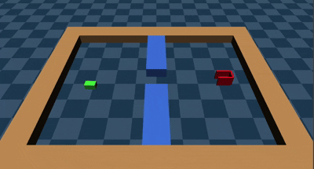
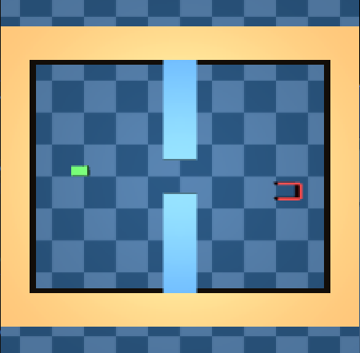
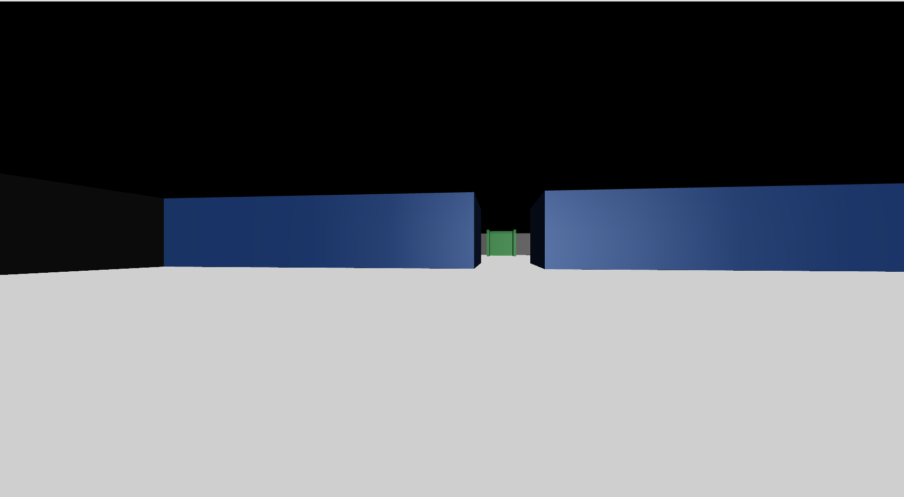

# gym-PlanarPeg

[English](#english) | [한국어](#한국어)


#### English

A 2.5D physical simulation environment for Planar Peg Insertion built on MuJoCo and Gymnasium. This environment is designed to evaluate generalization performance from Out-Of-Distribution (OOD) to In-Distribution (ID) environments and collect high-quality human demonstration data via teleoperation.

<div align="center">
  
</div>

### Overview
The task is to control a 3-DoF rectangular peg (agent) bound by a weld constraint to a virtual mocap target, navigate through a narrow gap in a grid-like maze, and dock into a C-shaped Goal Box on the opposite side.

The simulation runs on the MuJoCo 3D physics engine, but the agent's physical movement is perfectly constrained to the 2D plane ($X, Y, \theta$) through slide (translational) and hinge (rotational) joints. The goal box is rendered as a green C-shaped structure open on the left, and the agent is represented as a red rectangular block.

---

### Maze Layout and Configuration
The maze map is represented as a 2D text grid (list of strings). The grid encoding uses 5 core symbols:
* `W` or `#`: **Outer boundary wall** (rendered in gray)
* `O`: **Inner obstacle wall** (rendered in blue)
* `S` or `P`: **Agent spawn position** (start location)
* `C` or `G`: **C-shaped Goal Box** (open to the left, 1.5x thickened outer walls for stable docking)
* `.`: **Empty space**

#### Default Layout (11x9 Rectangular Grid)
The default configuration constructs a vertical wall of blue obstacles in the middle of the map, leaving exactly a single cell gap (`0.2m` wide) in the center. The agent spawns near the far-left wall, and the C-shaped goal slot is placed near the far-right wall to induce a wide exploration radius and Out-of-Distribution (OOD) data:
```python
grid = [
    "WWWWWWWWWWW",
    "W....O....W",
    "W....O....W",
    "W....O....W",
    "W.S.....C.W",
    "W....O....W",
    "W....O....W",
    "W....O....W",
    "WWWWWWWWWWW"
]
```

---

### Action Space
The action space is `Box([-x_limit, -y_limit, -pi], [x_limit, y_limit, pi], (3,), float32)`. Each element represents the **absolute physical target pose** of the virtual mocap control body:

| Index | Action | Min | Max | Unit Mapping (Physical) |
| :--- | :--- | :---: | :---: | :--- |
| **0** | Absolute X | $-x\_limit$ | $x\_limit$ | Target absolute X position (m) |
| **1** | Absolute Y | $-y\_limit$ | $y\_limit$ | Target absolute Y position (m) |
| **2** | Absolute Yaw | $-\pi$ | $\pi$ | Target absolute Z-axis rotation (rad) |

---

### Observation Space
The observation space is a goal-aware dictionary containing 3 keys:
* `image_top`: A top-down RGB image of the entire maze (`Box(0, 255, (224, 224, 3), dtype=np.uint8)`). Directional lighting ensures consistent shadows and brightness everywhere.
* `image_front`: A 1st-person forward-view RGB image attached `0.04m` to the front of the agent (`Box(0, 255, (224, 224, 3), dtype=np.uint8)`). Pulled slightly back into the body to prevent the camera from clipping through walls on collision.
* `proprioception`: A 3D state array representing the agent's actual absolute physical pose in the world (`Box(-inf, inf, (3,), dtype=np.float32)`). Uses the exact same absolute meter/radian scale as the action space.

| Top View Image (`image_top`) | Front View Image (`image_front`) |
| :---: | :---: |
|  |  |

| Index | Observation | Min | Max | Unit | Description |
| :--- | :--- | :---: | :---: | :---: | :--- |
| **0** | Agent X | -Inf | Inf | meters (m) | Absolute X position |
| **1** | Agent Y | -Inf | Inf | meters (m) | Absolute Y position |
| **2** | Agent Yaw ($\theta$) | -Inf | Inf | radians (rad) | Absolute Z-axis rotation |

---

### Rewards
* **Success Reward (Sparse):** **`+1.0`** reward is granted when the agent docks securely into the goal box, terminating the episode (`terminated=True`).
  * **Success Criteria**: The agent's center ($lx$) must enter the goal box local coordinate by at least `0.02m`. (This strictly checks geometric entry depth regardless of wall thickness or graphics.)
* **Time Penalty:** To encourage faster docking, a time cost of **`-0.01`** is applied per step until success.

---

### Starting State
On every episode reset, the agent and goal are placed following these rules:
1. **Agent Spawn:** The starting cell `S` is converted to Cartesian $(x,y)$ coordinates. A random position noise of **`[-0.05, 0.05]` meters** and an orientation noise of **`[-10.0°, 10.0°]`** are added.
2. **Agent Mocap Sync:** The control mocap target body is perfectly synchronized with this randomized spawn pose to prevent physical jerks.
3. **Goal Box Spawn (OOD Design):** The goal box spawns at cell `C`. Its orientation is **strictly fixed at 0.0°** to eliminate visual perspective changes (Vision OOD). However, its Y-axis position is heavily randomized by **`[-0.15, 0.15]` meters** to evaluate spatial Out-of-Distribution (OOD) generalization capabilities.

---

### Episode End
* **terminated (Success):** Returns `True` when the agent body lands inside the C-shaped goal box successfully.
* **truncated (Timeout):** Returns `True` when the current step count reaches the `max_episode_steps` limit (default: `250`).

---

### Installation
Use the following commands to set up the Conda workspace and install the package:

```bash
# Clone the repository
git clone https://github.com/YSL2683/gym-PlanarPeg.git
cd gym-PlanarPeg

# Create and activate conda environment
conda create -n planar_peg python=3.10 -y
conda activate planar_peg

# Install package in editable mode
pip install -e .
```

---

### Usage

#### 1. Registration Test
Test if the environment is properly registered in Gymnasium. You can also specify predefined grid names (e.g., `'default'`, `'empty'`):
```bash
python -c "import gymnasium as gym; import planar_peg; env = gym.make('PlanarPegInsertion-v0', grid='default'); print('Successfully created:', env.spec.id)"
```

#### 2. Play Mode (Teleoperation)
Operate the agent in real-time using a keyboard or a joystick (e.g., Playstation Controller) to test the environment mechanics **without saving data**:
```bash
python scripts/teleop.py --device joystick
```
* **Options**:
  * `--device` : Choose input device `joystick` or `keyboard` (default: `joystick`).
* **Keyboard Controls**: `W/S` (Up/Down), `A/D` (Left/Right), `Q/E` (Rotate CCW/CW), `R` (Manual Reset), `ESC` (Quit)
* **Joystick Controls (Twin-stick)**: `Left Stick` (Translation X/Y), `Right Stick` (Absolute Orientation - point to face), `L1/R1` (Relative Rotation), `X Button` (Reset), `O Button` (Quit)
* Distance and rotation clamping ensures the tracking error between the target command and actual robot stays within `0.10m` and `30 degrees`, creating realistic physics limits.

#### 3. Data Recording
Collect high-quality demonstration data in Zarr format for Offline RL or Diffusion Policy training:
```bash
python scripts/record.py --task ID_base --dataset_name my_dataset --num_episodes 50 --device joystick
```
* **Options**:
  * `--task` : Parent folder for dataset storage (default: `ID_base`).
  * `--dataset_name` : Name of the Zarr dataset (default: `dataset`). If an existing name is given, it will resume collection.
  * `--num_episodes` : Total successful episodes to collect (default: `50`).
  * `--device` : Input device `joystick` or `keyboard` (default: `joystick`).

#### 4. Data Viewer
A lightweight OpenCV-based viewer to verify Zarr data integrity and trajectory details.
```bash
python scripts/data_viewer.py --dataset data/ID_base/my_dataset.zarr
```
* **Options**:
  * `--dataset` : Path to the `.zarr` folder to visualize (Required).
* **Controls**: `SPACE` (Play/Pause), `A` (Prev Frame), `D` (Next Frame), `Q`/`ESC` (Quit)

---

### Zarr Data Format

Collected human demonstration data is safely accumulated in `data/<task_name>/<dataset_name>.zarr`.

#### 1. Datasets
For an episode of length $N$:

| Dataset Name | Shape | Dtype | Description |
| :--- | :--- | :---: | :--- |
| `image_top` | $(N, 224, 224, 3)$ | `uint8` | Top-view RGB image. |
| `image_front` | $(N, 224, 224, 3)$ | `uint8` | Front-view 1st-person RGB image. |
| `proprioception` | $(N, 3)$ | `float32` | Agent physical state `[X, Y, Theta]`. |
| `action` | $(N, 3)$ | `float32` | Target command `[Target_X, Target_Y, Target_Theta]`. |
| `reward` | $(N,)$ | `float32` | Reward at each step. |
| `terminated` | $(N,)$ | `bool` | Episode success flag. |

#### 2. Metadata Attributes
The root attributes (`attrs`) contain hardcoded metadata to prevent data corruption:
* `task` (`str`): Task environment folder name.
* `dataset_name` (`str`): Dataset identifier.
*(Resuming with mismatched parameters throws an abort error to protect data.)*

---

#### 한국어

[English](#english) | [한국어](#한국어)

MuJoCo와 Gymnasium을 기반으로 구축된 평면 쐐기 삽입(Planar Peg Insertion)을 위한 2.5D 물리 시뮬레이션 환경입니다. 본 환경은 분포 외(OOD) 환경에서 분포 내(ID) 환경으로의 일반화 성능 검증 및 텔레오퍼레이션(원격 조종)을 통한 고품질 사람 시연 데이터 수집을 목적으로 설계되었습니다.

<div align="center">
  
</div>

### 개요
본 환경의 태스크는 가상의 모캡(Mocap) 타겟에 weld 제약 조건으로 묶인 3-DoF 직사각형 peg(에이전트)를 조종하여, 격자형 미로 내 좁은 장애물 틈새(Gap)를 통과한 뒤 반대편에 위치한 C자형 골 박스(Goal Box)에 도킹하는 것입니다.

시뮬레이션은 MuJoCo 3D 물리 엔진을 기반으로 실행되지만, 에이전트의 물리적 움직임은 슬라이드(Slide, 병진) 및 힌지(Hinge, 회전) 조인트를 통해 2D 평면($X, Y, \theta$) 상으로 완벽히 구속됩니다. 골 박스는 왼쪽이 뚫려 있는 녹색 C자형 구조로 렌더링되며, 에이전트는 빨간색 직사각형 블록으로 표시됩니다.

---

### 미로 레이아웃 및 구성
미로 지도는 2D 텍스트 격자(문자열 리스트) 형태로 표현됩니다. 격자 인코딩에는 5가지 핵심 기호가 사용됩니다:
* `W` 또는 `#`: **외곽 경계 벽** (회색 렌더링)
* `O`: **내부 장애물 벽** (파란색 렌더링)
* `S` 또는 `P`: **에이전트 스폰 위치** (시작 위치)
* `C` 또는 `G`: **C자형 골 박스** (왼쪽으로 열린 형태, 안정적인 도킹을 위해 1.5배 두꺼워진 외벽 적용)
* `.`: **빈 공간**

#### 기본 레이아웃 (11x9 직사각형 격자)
기본 설정은 맵 중앙을 가로지르는 파란색 장벽을 한 칸(Cell) 단위로 쌓아 올리며, 정중앙에 정확히 한 칸(`0.2m`) 폭의 통과 구멍(Gap)을 제공하는 11x9 레이아웃입니다. 에이전트는 맵의 맨 왼쪽 벽 근처에 스폰되고, C자형 골 슬롯은 맨 오른쪽 벽 근처에 배치되어 넓은 탐색 반경과 OOD(Out-of-Distribution) 데이터를 유도합니다:
```python
grid = [
    "WWWWWWWWWWW",
    "W....O....W",
    "W....O....W",
    "W....O....W",
    "W.S.....C.W",
    "W....O....W",
    "W....O....W",
    "W....O....W",
    "WWWWWWWWWWW"
]
```

---

### 액션 공간 (Action Space)
액션 공간은 `Box([-x_limit, -y_limit, -pi], [x_limit, y_limit, pi], (3,), float32)`입니다. 각 원소는 가상 모캡(Mocap) 제어 바디의 **순수 절대 물리 좌표계** 타겟 포즈를 의미합니다:

| 번호 | 액션 | 제어 최소값 | 제어 최대값 | 매핑 대상 (실제 물리 단위) |
| :--- | :--- | :---: | :---: | :--- |
| **0** | 절대 X 좌표 | $-x\_limit$ | $x\_limit$ | 월드 좌표계 기준 절대 X축 목표 위치 (m) |
| **1** | 절대 Y 좌표 | $-y\_limit$ | $y\_limit$ | 월드 좌표계 기준 절대 Y축 목표 위치 (m) |
| **2** | 절대 회전각 (Yaw) | $-\pi$ | $\pi$ | Z축 기준 절대 목표 회전 각도 (rad) |

---

### 관측 공간 (Observation Space)
관측 공간은 에이전트의 상태 및 목표 지점 정보를 담은 목표 지향형(Goal-aware) 딕셔너리로 구성되며, 다음 3가지 키를 포함합니다:
* `image_top`: 미로 전체를 위에서 내려다보는 탑뷰 RGB 이미지 (`Box(0, 255, (224, 224, 3), dtype=np.uint8)`). 방향성(Directional) 조명을 적용하여 맵 어느 곳에서나 일관된 그림자와 밝기를 제공합니다.
* `image_front`: 직사각형 에이전트의 전면부(`0.04m` 앞)에 부착되어 전방을 바라보는 1인칭 전방 뷰 RGB 이미지 (`Box(0, 255, (224, 224, 3), dtype=np.uint8)`). 충돌 시 렌즈가 벽면을 투시하는 현상을 막기 위해 본체 안쪽으로 미세하게 당겨져 설계되었습니다.
* `proprioception`: 직사각형 에이전트의 실제 월드 절대 물리 포즈를 나타내는 3차원 상태 배열 (`Box(-inf, inf, (3,), dtype=np.float32)`). (액션 공간과 완벽히 동일한 절대 미터/라디안 스케일을 사용합니다.)

| Top View Image (`image_top`) | Front View Image (`image_front`) |
| :---: | :---: |
|  |  |

| 번호 | 관측 정보 | 최소값 | 최대값 | 단위 | 설명 |
| :--- | :--- | :---: | :---: | :---: | :--- |
| **0** | 에이전트 X 좌표 | -Inf | Inf | 미터 (m) | 월드 좌표계 기준 절대 X축 위치 |
| **1** | 에이전트 Y 좌표 | -Inf | Inf | 미터 (m) | 월드 좌표계 기준 절대 Y축 위치 |
| **2** | 에이전트 Yaw각 ($\theta$) | -Inf | Inf | 라디안 (rad) | Z축 기준 절대 회전 각도 |

---

### 보상 체계 (Rewards)
* **도킹 성공 보상 (Sparse):** 에이전트가 골 박스 내부에 안착했을 때 **`+1.0`** 보상이 지급되고 에피소드가 성공적으로 종료(`terminated=True`)됩니다.
  * **성공 판정 기준 (Success Criteria)**: 에이전트의 중심점($lx$)이 골 박스 로컬 좌표계 기준 `0.02m` 이상 깊숙이 진입할 것. (Goal 박스의 두께 및 그래픽 변화와 무관하게 안쪽 진입 깊이 기하학만을 엄밀히 검사합니다.)
* **타임 페널티 (Time Penalty):** 에이전트가 보다 신속하게 도킹 태스크를 완수하도록 유도하기 위해, 도킹에 성공하기 전까지 매 step마다 **`-0.01`**의 시간 비용 감점 보상이 가해집니다.

---

### 시작 상태 (Starting State)
에피소드가 리셋(reset)될 때마다 다음 규칙에 따라 에이전트와 목표(Goal)가 배치됩니다:
1. **에이전트 스폰:** 시작 셀 `S`의 좌표에 **`[-0.05, 0.05]` 미터**의 X/Y 위치 노이즈와 **`[-10.0°, 10.0°]`**의 회전 각도 노이즈가 추가됩니다.
2. **모캡 동기화:** 조종용 모캡(Mocap) 타겟은 리셋 직후 이 무작위화된 스폰 포즈와 완벽하게 동기화되어 물리적인 튕김 현상을 방지합니다.
3. **골 박스 스폰 (OOD 설계):** 연구 가설 검증을 위해 골 박스의 **회전 각도(방향)는 항상 0.0°로 완벽히 고정**되어 시각적 왜곡(Vision OOD)을 배제합니다. 대신, 위아래(Y축) 위치가 **`[-0.15, 0.15]` 미터**라는 매우 넓은 범위로 무작위화되어, 모델의 순수한 공간적 OOD 일반화 능력을 엄격하게 테스트합니다.

---

### 에피소드 종료 조건 (Episode End)
* **terminated (성공 종료):** 에이전트의 바디가 C자형 골 박스 내부에 안착하여 성공 판정을 받았을 때 `True`가 됩니다.
* **truncated (시간 초과 중단):** 현재 스텝 수가 에피소드 제한 규격인 `max_episode_steps` (기본값: `250`)에 도달했을 때 `True`가 됩니다.

---

### 설치 방법 (Installation)
Conda 작업 공간을 구성하고 패키지를 설치하려면 아래 명령어를 사용하십시오:

```bash
# 저장소 복제
git clone https://github.com/YSL2683/gym-PlanarPeg.git
cd gym-PlanarPeg

# Conda 가상환경 생성 및 활성화
conda create -n planar_peg python=3.10 -y
conda activate planar_peg

# 패키지를 개발자(Editable) 모드로 설치 (MuJoCo, gymnasium-robotics, Pygame 등 자동 설치)
pip install -e .
```

---

### 사용 방법 (Usage)

#### 1. 환경 등록 및 설치 검증
Gymnasium 레지스트리에 패키지가 정상적으로 연동되어 인스턴스를 생성할 수 있는지 테스트합니다. 사전에 정의된 맵 이름(`'default'`, `'empty'` 등)을 지정할 수 있습니다:
```bash
python -c "import gymnasium as gym; import planar_peg; env = gym.make('PlanarPegInsertion-v0', grid='default'); print('Successfully created:', env.spec.id)"
```

#### 2. 테스트 조종 (Play Mode)
**데이터 저장 없이** 조이스틱(예: Playstation 패드)이나 키보드를 사용하여 에이전트를 실시간으로 조작하며 환경의 동작 상태와 조작감을 점검할 수 있습니다:
```bash
python scripts/teleop.py --device joystick
```
* **명령어 옵션**:
  * `--device` : 입력 장치 선택 `joystick` 또는 `keyboard` (기본값: `joystick`).
* **키보드 조작**: `W/S` (상/하), `A/D` (좌/우), `Q/E` (회전), `R` (현재 에피소드 수동 리셋), `ESC` (종료)
* **조이스틱 조작 (트윈 스틱)**: `왼쪽 스틱` (상하좌우 이동), `오른쪽 스틱` (절대 각도 조준), `L1/R1` (회전 미세조정), `X 버튼` (수동 리셋), `O 버튼` (종료)
* 거리 및 회전 기반 클램핑(Clamping)이 적용되어 있어 조작 타겟과 실제 로봇의 위치 오차가 최대 `0.10m` 및 `30도`로 제한되어 현실적인 물리 충돌을 구현합니다.

#### 3. 데이터 기록 (Data Recording)
실제 오프라인 RL 및 Diffusion Policy 학습을 위한 고품질 궤적 데이터를 Zarr 형식으로 수집합니다:
```bash
python scripts/record.py --task ID_base --dataset_name my_dataset --num_episodes 50 --device joystick
```
* **명령어 옵션 (Options)**:
  * `--task` : 데이터가 저장될 상위 폴더 이름 (기본값: `ID_base`). 태스크나 난이도 분류 용도입니다.
  * `--dataset_name` : 생성될 Zarr 데이터셋의 이름 (기본값: `dataset`). 확장자(`.zarr`)는 자동 추가되며, 동일한 이름 지정 시 기존 데이터에 누적(Resume) 수집됩니다.
  * `--num_episodes` : 수집을 완료할 총 성공 에피소드 개수 (기본값: `50`). 설정한 목표치에 도달하면 스크립트가 자동 종료됩니다.
  * `--device` : 데이터 수집용 입력 장치 선택 `joystick` 또는 `keyboard` (기본값: `joystick`).

#### 4. 수집 데이터 시각화 (Data Viewer)
기록된 Zarr 데이터의 무결성을 검증하고 궤적을 확인하기 위한 순수 OpenCV 기반 경량 뷰어입니다. 
X, Y, Theta 세 가지 축의 변화량을 동일한 Y스케일의 독립된 서브플롯(Sub-plot)으로 분리하여 절대 물리 단위(Raw Value) 그대로 왜곡 없이 정밀하게 비교할 수 있습니다.
```bash
python scripts/data_viewer.py --dataset data/ID_base/my_dataset.zarr
```
* **명령어 옵션 (Options)**:
  * `--dataset` : 시각화할 `.zarr` 데이터셋 폴더의 상대적/절대적 경로를 지정합니다. (필수 입력)
* **단축키**: `SPACE` (자동 재생 / 일시정지), `A` (이전 프레임 역재생), `D` (다음 프레임 재생), `Q` / `ESC` (뷰어 종료)

---

### 데이터 저장 형식 (Zarr Data Format)

수집된 사람 시연 데이터(Demonstration Data)는 `data/<task_name>/<dataset_name>.zarr` 디렉토리에 Zarr 포맷으로 안전하게 누적 저장됩니다. 데이터 로더에서 즉시 꺼내어 쓸 수 있도록 모든 물리량의 스케일과 좌표계가 통일되어 있습니다.

#### 1. 데이터셋 구조 (Datasets)
각 에피소드는 궤적 길이($N$) 동안 매 step 수집된 다음 배열들로 구성됩니다:

| 데이터셋 이름 | 차원 (Shape) | 데이터 타입 | 설명 |
| :--- | :--- | :---: | :--- |
| `image_top` | $(N, 224, 224, 3)$ | `uint8` | 탑뷰(Top-view) RGB 이미지 관측값. |
| `image_front` | $(N, 224, 224, 3)$ | `uint8` | 에이전트 전면에 장착된 1인칭 전방뷰 RGB 이미지 관측값. |
| `proprioception` | $(N, 3)$ | `float32` | 에이전트의 실제 물리 상태 `[X, Y, Theta]`. ($X, Y$: 미터, $Theta$: 라디안) |
| `action` | $(N, 3)$ | `float32` | 제어용 타겟 명령 좌표 `[Target_X, Target_Y, Target_Theta]`. ($X, Y$: 미터, $Theta$: 라디안) |
| `reward` | $(N,)$ | `float32` | 각 step에서 획득한 보상 (도킹 성공 시 `+1.0`, 타임 페널티 `-0.01`). |
| `terminated` | $(N,)$ | `bool` | 에피소드 성공 종료 여부 플래그 (도킹 성공 시 `True`). |

#### 2. 메타데이터 속성 (Attributes)
Zarr 스토어의 루트 속성(`attrs`)에는 데이터 오염 및 덮어쓰기 방지를 위한 메타데이터가 하드 코딩되어 안전장치 역할을 합니다:
* `task` (`str`): 데이터 수집 시 지정된 태스크 환경 폴더명
* `dataset_name` (`str`): 데이터셋 식별 이름
* (이후 수집 스크립트 실행 시 전달된 파라미터가 기존 파일의 속성과 일치하지 않을 경우 치명적 에러(Abort)를 발생시켜 데이터를 강력하게 보호합니다.)
